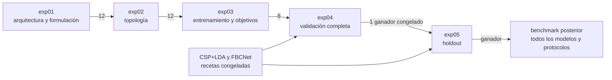

# Peterson Model Search V12: diseño experimental

Fecha: 2026-10-10  
Rama: `exp/peterson-model-search-v12`  
Base inmutable: `exp/peterson-diffusion-v11@de0813d`  
Baseline confirmatorio: Peterson V10, revisión `6c116d5`

## 1. Objetivo

V12 buscará una arquitectura que mejore la clasificación `motor_imagery_vs_rest` del dataset
MI-OpenBCI/Peterson en el protocolo `within_session`. La búsqueda se concentrará en la condición
`overlap`, seleccionada en V11 después de superar `center_x6` en 7.624 puntos porcentuales de
accuracy media, con dirección favorable en los diez participantes.

Durante V12 solo habrá dos baselines externos:

- CSP+LDA, como referencia clásica;
- FBCNet, como referencia profunda principal.

Las versiones discriminativa, energética e híbrida de cada candidato son controles internos. Su
función es identificar qué componente explica una mejora; no se presentarán como baselines externos
adicionales.

V12 termina cuando una configuración queda congelada o cuando ninguna supera los criterios de
promoción. El ganador se incorporará después a un benchmark separado con todos los modelos,
condiciones y protocolos. Esa evaluación amplia no forma parte de la búsqueda V12.

## 2. Alcance congelado

| Elemento | Valor V12 |
|---|---|
| Dataset | MI-OpenBCI/Peterson |
| Sujetos | `S02-S10`, `S12` |
| Tarea | MI vs rest |
| Protocolo de búsqueda | `within_session` |
| Condición primaria | `overlap` |
| Unidad estadística | participante |
| Baselines externos | CSP+LDA, FBCNet |
| Seeds de cribado | 0 |
| Seeds confirmatorias | 0-4 |
| LOSO | fuera de V12 |
| Souza2023 | fuera de V12 |
| Métrica primaria | accuracy por trial |

No se modificarán los archivos ni resultados de V10 o V11. Los splits exteriores serán los mismos
de V10. Todas las ventanas derivadas de un trial permanecerán en el mismo fold.

Los participantes se dividirán antes de entrenar mediante SHA-256 del texto
`peterson-v12-subject-partition-20261010:<subject>`:

- descubrimiento: `S09`, `S03`, `S02`, `S10`, `S12`, `S08`;
- holdout: `S07`, `S04`, `S05`, `S06`.

El orden corresponde al hash ascendente. `exp01-exp04` solo accederán a los seis participantes de
descubrimiento. `exp05` solo accederá a los cuatro participantes holdout.

## 3. Separación entre búsqueda y confirmación

Las configuraciones de `exp01` a `exp04` se ordenarán exclusivamente mediante validación interna de
los participantes de descubrimiento. El runner no calculará ni guardará predicciones del test
exterior durante esas etapas. `exp04` congelará un único ganador. `exp05` abrirá el test una sola vez
para ese ganador en los participantes holdout.



Esta separación evita seleccionar arquitectura, hiperparámetros o regularización a partir del mismo
test usado para estimar el resultado final.

## 4. Hipótesis

### H1. Representación temporal-espacial

Una arquitectura temporal-espacial ajustada para EEG de pocos canales superará a FBCNet en al menos
2 puntos porcentuales de accuracy media por participante.

### H2. Formulación del aprendizaje

Una pérdida híbrida de clasificación y denoising superará a la misma arquitectura entrenada solo con
entropía cruzada. La comparación siempre emparejará backbone, anchura, split y presupuesto.

### H3. Sesgo inductivo

Filter banks aprendibles, convoluciones multiescala o bases temporales suaves aportarán más que el
simple aumento de anchura o profundidad.

### H4. Regularización orientada a low-cost

Channel dropout y temporal masking aumentarán la consistencia entre participantes sin reducir la
accuracy limpia en más de 1 punto porcentual.

### H5. Eficiencia

Al menos un candidato ocupará una posición Pareto-superior a FBCNet en accuracy, parámetros y
latencia por trial.

## 5. Métricas y reglas de decisión

La métrica primaria de `exp01-exp05` será accuracy por trial, promediada primero entre folds o seeds
dentro de participante y después entre participantes. Las métricas secundarias serán kappa,
macro-F1, AUROC, NLL y Brier. Los guardrails operativos serán:

- colapso de predicciones;
- accuracy del cuartil inferior de participantes;
- número de parámetros;
- latencia por trial y throughput;
- memoria GPU máxima;
- número de épocas y actualizaciones hasta el mejor checkpoint.

En los cribados se ordenará por accuracy media de validación. Si dos configuraciones difieren menos
de 0.5 puntos porcentuales, se preferirá la de menor cuartil inferior más alto. Si persiste el empate,
se elegirá la de menos parámetros y menor latencia.

En `exp05`, la ruta principal de éxito exige:

1. diferencia media frente a FBCNet de al menos +2 puntos porcentuales;
2. dirección favorable en al menos 3 de 4 participantes holdout;
3. intervalo bootstrap descriptivo de la diferencia;
4. ausencia de pérdida material en kappa.

Con cuatro participantes holdout, V12 no interpretará un p-valor como prueba confirmatoria. Las
pruebas pareadas y la corrección Holm corresponderán al benchmark posterior con los diez sujetos y
los protocolos congelados.

Una ruta de eficiencia permitirá congelar un candidato situado dentro de 1 punto porcentual de
FBCNet si reduce al menos 30% los parámetros o la latencia y no empeora materialmente kappa. Esta
ruta se informará como resultado de eficiencia, no como superioridad de accuracy.

## 6. Programa experimental

### exp01: arquitectura y formulación

Se construirán 36 configuraciones a partir de:

- seis backbones: residual temporal, TCN dilatada, inception multikernel, filter-bank
  temporal-espacial, SmoothBasis y Conformer ligero;
- tres formulaciones: discriminativa, energía de difusión e híbrida clasificación-denoising;
- dos anchuras de representación.

Cada configuración usará los seis participantes de descubrimiento, seed 0, los folds 0 y 2, hasta
80 épocas y paciencia 20. El manifiesto tendrá 216 celdas. Avanzarán 12 configuraciones.

Para preservar diversidad, podrán avanzar como máximo tres configuraciones del mismo backbone. El
conjunto promovido debe contener al menos dos formulaciones, salvo que una formulación falle en más
de 25% de sus celdas o quede dominada por completo.

### exp02: topología temporal y espacial

Cada una de las 12 configuraciones promovidas generará ocho perfiles estructurales. Los perfiles
cubrirán:

- dos o cuatro bloques;
- anchura compacta o amplia;
- kernels temporales cortos, largos o multiescala;
- dilatación lineal o exponencial;
- convolución estándar o depthwise-separable;
- pooling medio, estadístico o por atención;
- dropout estructural bajo o moderado;
- conexiones residuales y normalización compatibles con cada backbone.

El catálogo tendrá 96 configuraciones y 576 celdas: seis participantes de descubrimiento, seed 0,
folds 0, 2 y 4, hasta 150 épocas y paciencia 35. Avanzarán 12 configuraciones.

### exp03: optimización, objetivos y regularización

Cada uno de los 12 candidatos promovidos se combinará con 12 recetas congeladas. Las recetas se
generarán una sola vez mediante un diseño de baja discrepancia con seed fijo y después se guardarán
como JSON explícito. No se volverán a muestrear durante la ejecución.

El espacio cubrirá:

- learning rate: `1e-4`, `3e-4`, `6.25e-4`, `1e-3`;
- weight decay: `0`, `1e-4`, `1e-3`, `1e-2`;
- batch size: 32, 64, 128;
- dropout: 0, 0.2, 0.4;
- label smoothing: 0, 0.05, 0.1;
- channel dropout: 0, 0.1, 0.2;
- temporal masking: 0, 0.1, 0.2 de la longitud;
- AdamW y Lion local auditado;
- cosine decay, one-cycle y reduce-on-plateau;
- clipping de gradiente: 1 y 5;
- pasos de difusión: 50, 100 y 200;
- pesos de clasificación, denoising, ranking y consistencia.

Los campos que no aplican a una formulación se guardarán como `null`, no como valores ignorados. El
generador rechazará recetas duplicadas. El manifiesto tendrá 144 configuraciones y 864 celdas: seis
participantes de descubrimiento, seed 0, folds 0, 2 y 4, hasta 200 épocas y paciencia 50. Avanzarán
ocho configuraciones.

### exp04: validación completa

Los ocho candidatos se ejecutarán en los seis participantes de descubrimiento, los cinco folds,
seed 0, hasta 300 épocas y paciencia 75. CSP+LDA y FBCNet se evaluarán sobre las mismas particiones
internas y quedarán cacheados por hash. El manifiesto tendrá 48 celdas candidatas y 12 celdas
baseline.

La selección seguirá usando únicamente validación. Avanzará una configuración congelada. No se
permitirá cambiar arquitectura, objetivo o hiperparámetros después de esta decisión. Se registrarán
el segundo y tercer lugar para análisis, pero no podrán acceder al holdout.

### exp05: confirmación exterior

El ganador se ejecutará con los cuatro participantes holdout, cinco seeds, cinco folds y el
presupuesto completo. El manifiesto tendrá 20 celdas candidatas. Las comparaciones externas usarán
los resultados CSP+LDA y FBCNet de V10 cuando coincidan dataset, condición, split, preprocesamiento y
presupuesto. Cualquier discrepancia de hash obligará a reentrenar solo el baseline afectado.

El análisis producirá diferencias pareadas por participante, intervalos bootstrap descriptivos,
consistencia direccional y sensibilidad por seed. No se declarará significancia inferencial con
cuatro participantes.

## 7. Presupuesto estimado

| Experimento | Configuraciones | Celdas candidatas | Recurso por celda |
|---|---:|---:|---|
| exp01 | 36 | 216 | 6 sujetos, 2 folds, 80 épocas |
| exp02 | 96 | 576 | 6 sujetos, 3 folds, 150 épocas |
| exp03 | 144 | 864 | 6 sujetos, 3 folds, 200 épocas |
| exp04 | 8 | 48 | 6 sujetos, 5 folds, 300 épocas |
| exp05 | 1 | 20 | 4 sujetos holdout, 5 folds, 5 seeds |

Las etapas se ejecutarán secuencialmente. Una etapa no se generará a partir de resultados parciales:
el manifiesto completo debe terminar y pasar auditoría antes de aplicar la regla de promoción.

## 8. Integridad y reproducibilidad

Cada celda guardará:

- ID de experimento (`exp01` a `exp05`), configuración y familia;
- commit y estado Git;
- hashes de código, dataset, split, catálogo y configuración;
- sujeto, fold, seed y condición;
- índices de entrenamiento, validación y test cuando corresponda;
- conteos de trials, ventanas, batches y actualizaciones;
- historia de entrenamiento y mejor época;
- métricas permitidas por la etapa;
- parámetros, tiempo, memoria y estado final.

En `exp01-exp04`, el esquema rechazará cualquier campo de predicción o métrica del test exterior. En
`exp05`, exigirá exactamente una predicción agregada por trial. Un checkpoint solo podrá reutilizarse
si coincide su fingerprint completo.

El auditor rechazará:

- intersección de trials entre train, validation y test;
- selección ajustada con test;
- celdas faltantes, extra o duplicadas;
- NaN, gradientes no finitos o colapso de clase;
- recetas o splits con hashes inesperados;
- promociones que no correspondan al archivo de decisión anterior;
- resultados producidos por un árbol Git sucio.

## 9. Organización del repositorio

El desarrollo vivirá en:

```text
benchmark_deep_v2_search_v12/
└── experiments/peterson_search_v12/
    ├── exp01_architecture_formulation/
    ├── exp02_topology/
    ├── exp03_training_objectives/
    ├── exp04_full_validation/
    ├── exp05_confirmation/
    ├── audit/
    ├── decisions/
    └── common/
```

Los resultados no se versionarán:

```text
results_peterson_search_v12/
├── exp01_<commit>/
├── exp02_<commit>/
├── exp03_<commit>/
├── exp04_<commit>/
└── exp05_<commit>/
```

Cada experimento tendrá un commit propio con su catálogo, manifiesto, hipótesis, criterios de
promoción y auditor. Después de recibir y validar el export de Cayetano, se añadirá un archivo de
decisión inmutable antes de preparar el experimento siguiente.

## 10. Ejecución en Cayetano

El launcher aceptará `PETERSON_SEARCH_EXPERIMENT=exp01` a `exp05` y dos dispositivos CUDA. Repartirá
celdas disjuntas entre `cuda:0` y `cuda:1`, permitirá reanudación por fingerprint y terminará con un
auditor específico de la etapa. Ningún launcher generará automáticamente el experimento siguiente.

Antes de cada ejecución completa habrá un smoke dual-GPU con directorio y manifiesto propios. El
smoke no contará como evidencia y no podrá producir el archivo de finalización de una corrida
completa.

## 11. Resultado posterior a V12

Si `exp05` produce un ganador, se congelarán arquitectura, preprocesamiento, condición, objetivo,
hiperparámetros, calibración e inferencia. Un proyecto posterior aplicará esa configuración al
benchmark completo con los modelos y protocolos del paper. V12 no anticipará el resultado de esa
fase ni afirmará generalización cross-session o LOSO.

Si ningún candidato cumple las rutas de accuracy o eficiencia, se conservarán los resultados como
estudio negativo y FBCNet seguirá siendo la referencia profunda principal.
